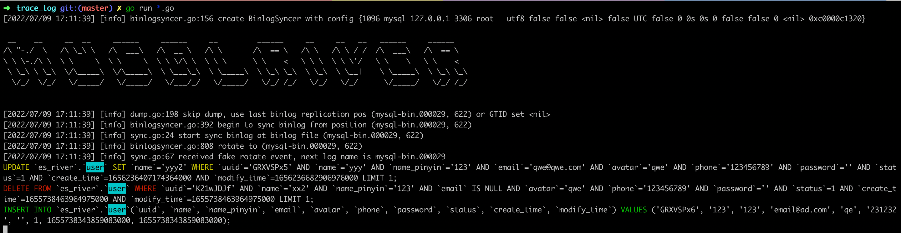

# MySQL-river

解析 binlog，提供三种 handler

- trace log：将 binlog 实时翻译为 sql 语句。
- Elastic search sync：将 binlog 的数据同步到 es 中。
- Kafka broker：将 binlog 的数据同步到 Kafka 中，和 MySQL 彻底解耦。


## trace log

复用 [mysql-flashback](https://github.com/obgnail/mysql-flashback) 的功能。详细可见 flashback 库。




## Elastic search sync

fork 自 [go-mysql-elasticsearch](https://github.com/go-mysql-org/go-mysql-elasticsearch)，添加了 health check 功能。详细使用参见 go-mysql-elasticsearch 库。


### health check

对比 `master.info` 和 `canal.GetMasterPos()` 的 position 信息，写入 health.info 文件中。后续可以加入自动告警功能。

- 当获取 binlog-pos 失败时， 健康状态为 red
- 当 binlog-pos 跟 master-pos 相差在阈值内， 健康状态为 green
- 当 binlog-pos 跟 master-pos 相关在阈值外时， 健康状态为 yellow
- 当 binlog-pos 跟 上次记录的 binlog-pos 没有变化时，且master-pos 跟 上次记录的 master-pos 没有变化时，且 binlog-pos  跟  master-pos 相等时 健康状态为 green
- 当 binlog-pos 跟 上次记录的 binlog-pos 没有变化时，且master-pos 跟 上次记录的 master-pos 没有变化时，且 binlog-pos  大于  master-pos 时 健康状态为 red
- 当 binlog-pos 跟 上次记录的 binlog-pos 没有变化时，且master-pos 跟 上次记录的 master-pos 有变化时， 健康状态为 green
- 当 binlog-pos 跟 上次记录的 binlog-pos 有变化时， 且 master-pos 跟 上次记录的 master-pos 没有变化时， 健康状态为 red
- 当 binlog-pos 跟 上次记录的 binlog-pos 有变化时， 且 master-pos 跟 上次记录的 master-pos 有变化时， 健康状态为 green


### 单元测试环境部署

#### elasticsearch部署

用于测试的es配置参考/etc/river-test/elasticsearch.yml
```yaml
network.host: 0.0.0.0

http:
  port: 9200

script.engine.groovy:
  inline:
    update: on
    search: on
  file:
    update: on
    search: on

elasticfence.disabled: true
```

运行容器

```
docker run --name es-river-test -p 9200:9200 \
    -v /etc/river-test/elasticsearch.yml:/usr/share/elasticsearch/config/elasticsearch.yml \
    -d elasticsearch-v2.4.1:v0.0.3-109-g9d19c
```

#### mysql部署

用于测试的mysql参考配置/etc/river-test/my.cnf

```ini
[mysqld]

port = 3306

init-connect = 'SET NAMES utf8mb4'
character-set-server = utf8mb4
performance_schema_max_table_instances = 200
table_definition_cache=200
table_open_cache=128

character_set_server=utf8mb4
collation_server=utf8mb4_unicode_ci
init_connect='SET NAMES utf8mb4'

skip-name-resolve
back_log = 600
max_connections = 1000
max_connect_errors = 6000
open_files_limit = 65535
max_allowed_packet = 512M
binlog_cache_size = 1M
max_heap_table_size = 8M
tmp_table_size = 16M
read_buffer_size = 2M
read_rnd_buffer_size = 8M
sort_buffer_size = 8M
join_buffer_size = 8M
thread_cache_size = 8
query_cache_size = 8M
query_cache_limit = 2M
key_buffer_size = 4M
ft_min_word_len = 4
transaction_isolation = REPEATABLE-READ


datadir=/var/lib/mysql
socket=/var/lib/mysql/mysql.sock
server-id = 1
log-bin = mysql-bin
log_slave_updates = on
auto_increment_increment=1
auto_increment_offset=1


log_bin = mysql-bin
binlog_format = row
expire_logs_days = 7
slow_query_log = 1
long_query_time = 1
slow_query_log_file = /var/lib/mysql/mysql-slow.log
performance_schema = 0
explicit_defaults_for_timestamp
skip-external-locking
default-storage-engine = InnoDB
innodb_file_per_table = 1
innodb_open_files = 500
innodb_buffer_pool_size = 8G
innodb_write_io_threads = 4
innodb_read_io_threads = 4
innodb_thread_concurrency = 0
innodb_purge_threads = 1
innodb_flush_log_at_trx_commit = 2
innodb_log_buffer_size = 2M
innodb_log_file_size = 32M
innodb_log_files_in_group = 3
innodb_max_dirty_pages_pct = 90
innodb_lock_wait_timeout = 120
bulk_insert_buffer_size = 8M
myisam_sort_buffer_size = 8M
myisam_max_sort_file_size = 10G
myisam_repair_threads = 1
interactive_timeout = 28800
wait_timeout = 28800
net_read_timeout = 600
net_write_timeout = 600


#GTID:
gtid_mode=on
enforce_gtid_consistency=on
session_track_gtids=OWN_GTID
session_track_state_change=ON

#skip-grant-tables

# Disabling symbolic-links is recommended to prevent assorted security risks
symbolic-links=0

log-error=/var/log/mysqld.log
pid-file=/var/run/mysqld/mysqld.pid
```

启动容器

```sh
docker run --name mysql-river-test -p 3306:3306 \
    -v /etc/river-test/my.cnf:/etc/my.cnf \
    -e MYSQL_ROOT_PASSWORD=root -d mysql:v5.7.30

docker run --name mysql-health-test -p 3307:3306 \
    -v /etc/river-test/my.cnf:/etc/my.cnf \
    -e MYSQL_ROOT_PASSWORD=root -d mysql:v5.7.30
```

授权及建库

```sh
docker exec mysql-river-test  mysql -uroot -proot -e "grant all privileges  on *.* to root@'%' identified by \"root\";flush privileges;create database test;"
docker exec mysql-health-test   mysql -uroot -proot -e "grant all privileges  on *.* to root@'%' identified by \"root\";flush privileges;create database test;"
```

运行单元测试
```shell
go test
```


## Kafka broker

消息格式：

```go
type FormatData struct {
	ServerID  uint32                 `json:"server_id"`
	LogPos    uint32                 `json:"log_pos"`
	Db        string                 `json:"db"`
	Table     string                 `json:"table"`
	SQL       string                 `json:"sql"`        // 主要用于 DDL event
	EventType string                 `json:"event_type"` // 操作类型 insert、update、delete、ddl、gtid、xid
	GTID      string                 `json:"gtid"`       // 存储gtid
	Primary   []string               `json:"primary"`    // 主键字段；EventType非ddl时有值
	Before    map[string]interface{} `json:"before"`     // 变更前数据, insert 类型的 before 为空
	After     map[string]interface{} `json:"after"`      // 变更后数据, delete 类型的 after 为空
	Timestamp uint32                 `json:"timestamp"`  // 事件时间
}
```

