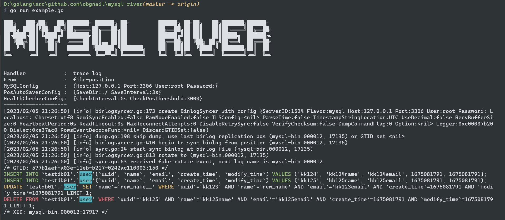

# MySQL-River

## introduction

解析 mysql binlog，提供简单易用的同步方案。

内置三个电池：

- TraceLog：将 binlog 实时翻译为 sql 语句。
- ElasticSearchSync：将 binlog 的数据同步到 es 中。
- KafkaBroker：将 binlog 的数据同步到 Kafka 中，和 MySQL 彻底解耦。


## feather

mysql-river 内置 auto position saver 和 auto health checker 两个功能：

- auto position saver：自动记录 river 的处理进展，将其保存为 master.info 文件。当 river 挂掉重启后依旧可以恢复进展，不必担心数据丢失。
- auto health checker：提供健康检测接口。当 river 的进展和 mysql binlog 的进展差值超过阈值时，触发对应函数。


### health check rule

对比 `master.info`(file-pos) 和 `canal.GetMasterPos()`(db-pos) 的 position 信息，当触发规则时，调用对应函数。可以对接自动告警功能。

- 当获取 db-pos 失败时， 健康状态为 red
- 当 db-pos 跟 file-pos 相差在阈值内， 健康状态为 green
- 当 db-pos 跟 file-pos 相关在阈值外时， 健康状态为 yellow
- 当 db-pos 跟 上次记录的 db-pos 没有变化时，且file-pos 跟 上次记录的 file-pos 没有变化时，且 db-pos  跟  file-pos 相等时 健康状态为 green
- 当 db-pos 跟 上次记录的 db-pos 没有变化时，且file-pos 跟 上次记录的 file-pos 没有变化时，且 db-pos  大于  file-pos 时 健康状态为 red
- 当 db-pos 跟 上次记录的 db-pos 没有变化时，且file-pos 跟 上次记录的 file-pos 有变化时， 健康状态为 green
- 当 db-pos 跟 上次记录的 db-pos 有变化时， 且 file-pos 跟 上次记录的 file-pos 没有变化时， 健康状态为 red
- 当 db-pos 跟 上次记录的 db-pos 有变化时， 且 file-pos 跟 上次记录的 file-pos 有变化时， 健康状态为 green


### Usage

只需实现 Handler 接口：

- OnEvent：核心函数。river 会自动解析 mysql binlog 文件，将 20+ 种 event 归纳为 insert、update、delete、ddl、gtid、xid、rotate、table_changed 几种。
- OnAlert：auto health check 不通过时自动调用此函数，可以对接自动告警功能。
- OnClose：river 发生不可恢复错误时，自动调用此函数，可以用此关闭 handler 或对接自动告警功能。

```go
type Handler interface {
	String() string
	OnEvent(event *EventData) error
	OnAlert(msg *StatusMsg) error
	OnClose(river *River) // OnEvent、OnAlert抛出的error会触发OnClose
}
```

```go
type EventData struct {
	// insert、update、delete、ddl、gtid、xid、rotate、table_changed
	EventType string                 `json:"event_type"`
	ServerID  uint32                 `json:"server_id"`
	LogName   string                 `json:"log_name"`
	LogPos    uint32                 `json:"log_pos"`
	Db        string                 `json:"db"`
	Table     string                 `json:"table"`
	SQL       string                 `json:"sql"` // 仅当EventType为ddl有值
	GTIDSet   string                 `json:"gtid_set"`
	Primary   []string               `json:"primary"`   // 主键字段；EventType为insert、update、delete时有值
	Before    map[string]interface{} `json:"before"`    // 变更前数据, insert 类型的 before 为空
	After     map[string]interface{} `json:"after"`     // 变更后数据, delete 类型的 after 为空
	Timestamp uint32                 `json:"timestamp"` // 事件时间
}
```

```go
type StatusMsg struct {
	Status        HealthStatus
	LastStatus    HealthStatus
	Reason        []string // 发生告警时的消息(可能有多条不通过)
	FilePos       *mysql.Position
	DBPos         *mysql.Position
	CheckInterval time.Duration
	PosThreshold  int
}
```


## example

```go
package main

import (
	"fmt"
	"github.com/obgnail/mysql-river/river"
	"time"
)

var config = &river.Config{
	MySQLConfig: &river.MySQLConfig{
		Host:     "127.0.0.1",
		Port:     3306,
		User:     "root",
		Password: "root",
	},
	PosAutoSaverConfig: &river.PosAutoSaverConfig{
		SaveDir:      "./",
		SaveInterval: 3 * time.Second,
	},
	HealthCheckerConfig: &river.HealthCheckerConfig{
		CheckPosThreshold: 3000,
		CheckInterval:     5 * time.Second,
	},
}

func main() {
	err := river.New(config).
		SetHandler(river.NopCloserAlerter(func(event *river.EventData) error {
			fmt.Println(event.EventType, event.LogName, event.LogPos, event.Before, event.After)
			return nil
		})).
		Sync(river.FromFile) // 从 master.info 文件开始解析
	PanicIfError(err)
}
```


## Built-in battery

### trace log



```go
var config = &river.Config{
	MySQLConfig: &river.MySQLConfig{
		Host:     "127.0.0.1",
		Port:     3306,
		User:     "root",
		Password: "root",
	},
	PosAutoSaverConfig: &river.PosAutoSaverConfig{
		SaveDir:      "./",
		SaveInterval: 3 * time.Second,
	},
	HealthCheckerConfig: &river.HealthCheckerConfig{
		CheckPosThreshold: 3000,
		CheckInterval:     5 * time.Second,
	},
}

func main() {
	dbs := []string{"testdb01"}
	entireFields := false // show all field message in update sql
	showTxMsg := true     // show transition msg in sql
	highlight := true     //  highlight sql expression
	handler := trace_log.New(dbs, entireFields, showTxMsg, highlight)
	err := river.New(config).SetHandler(handler).Sync(river.FromFile) // 从最新位置开始解析
	PanicIfError(err)
}
```


### elastic search sync

```go
var config = &river.Config{
	MySQLConfig: &river.MySQLConfig{
		Host:     "127.0.0.1",
		Port:     3306,
		User:     "root",
		Password: "root",
	},
	PosAutoSaverConfig: &river.PosAutoSaverConfig{
		SaveDir:      "./",
		SaveInterval: 3 * time.Second,
	},
	HealthCheckerConfig: &river.HealthCheckerConfig{
		CheckPosThreshold: 3000,
		CheckInterval:     5 * time.Second,
	},
}

func main() {
	handlerConfig := &elasticsearch.EsHandlerConfig{
		Host:          "127.0.0.1",
		Port:          9200,
		User:          "",
		Password:      "",
		BulkSize:      128,
		FlushInterval: time.Second,
		SkipNoPkTable: true,
		Rules: []*elasticsearch.Rule{
			elasticsearch.NewDefaultRule("testdb01", "user"),
		},
	}
	handler := elasticsearch.New(handlerConfig)
	err := river.New(config).SetHandler(handler).Sync(river.FromDB)
	PanicIfError(err)
}
```


### kafka broker

```go
var config = &river.Config{
	MySQLConfig: &river.MySQLConfig{
		Host:     "127.0.0.1",
		Port:     3306,
		User:     "root",
		Password: "root",
	},
	PosAutoSaverConfig: &river.PosAutoSaverConfig{
		SaveDir:      "./",
		SaveInterval: 3 * time.Second,
	},
	HealthCheckerConfig: &river.HealthCheckerConfig{
		CheckPosThreshold: 3000,
		CheckInterval:     5 * time.Second,
	},
}

func main() {
	addrs := []string{"127.0.0.1:9092"}
	topic := "binlog"
	handler, err := kafka.New(addrs, topic)
	PanicIfError(err)
	go handler.Consume(func(msg *sarama.ConsumerMessage) error {
		fmt.Printf("Partition:%d, Offset:%d, key:%s, value:%s\n",
			msg.Partition, msg.Offset, string(msg.Key), string(msg.Value))
		return nil
	})
	err = river.New(config).SetHandler(handler).Sync(river.FromFile)
	PanicIfError(err)
}
```

